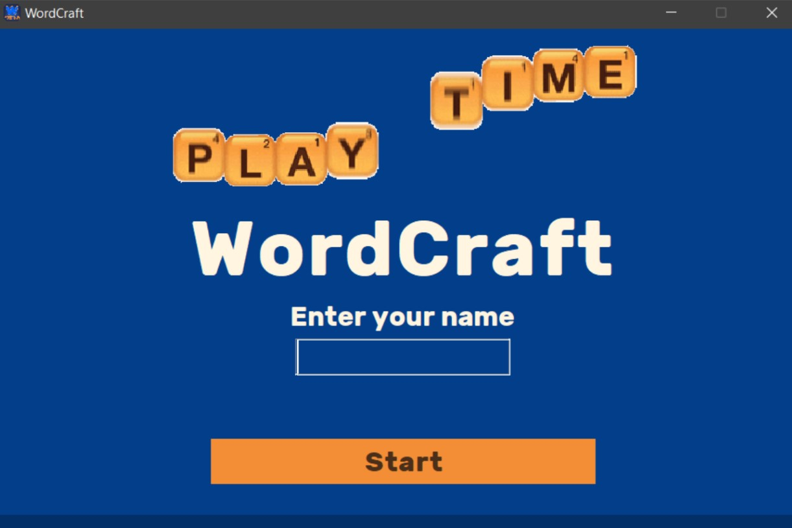
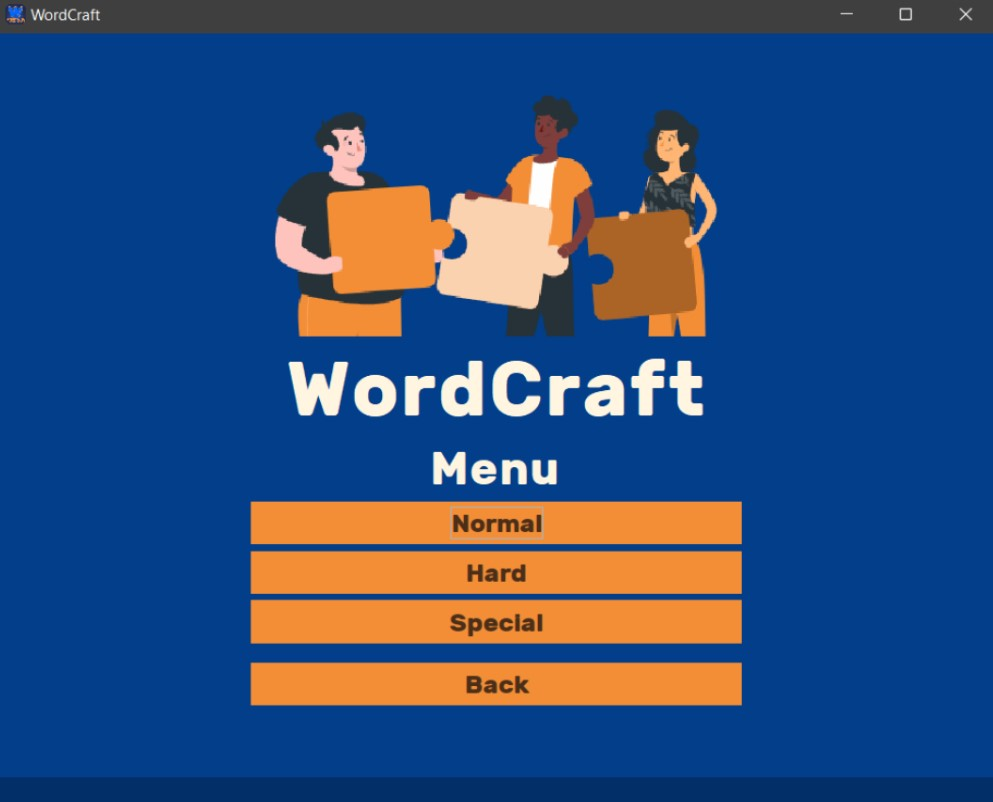
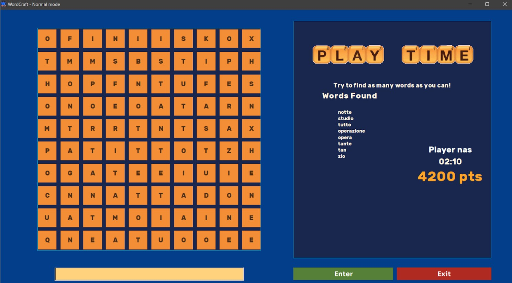
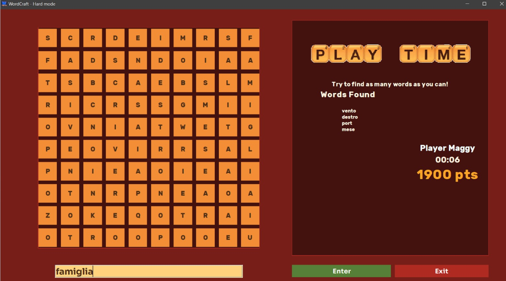

  <h1>
      WordCraft
  </h1>
    
  <h3>An amusing word game created in Java</h3>
  
With 3 different modes including one to make you laugh

  

     
     
    <h2>Modes</h2>
     
     
    
We also have a third mode but of its explicit nature, we won't add a screenshot here

  

